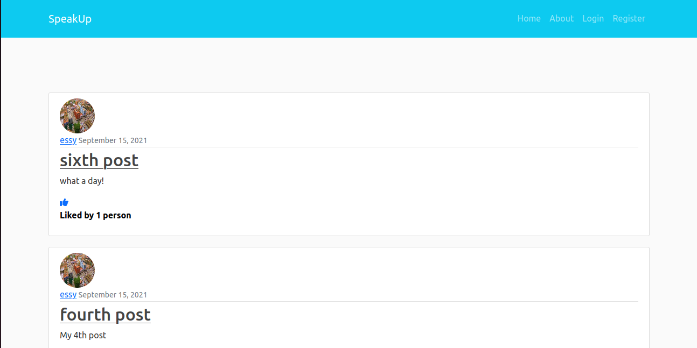

# Blog Application

A blog application with CRUD functionality and enables you also to like a post .

This application has been built using Django.

## Screenshots



## Installation

Install my-project with the requirements.txt

```bash
  clone the project
  set up your environnment and download the required packages using the requirements.txt
```

## 🛠 Skills

Python, Django, HTML, CSS...

## 🔗 Links

[](https://kabszac.github.io/)
[](https://www.linkedin.com/in/isaac-kabucho)

## Feedback

If you have any feedback, please reach out to us at kabszac@gmail.com

## License

[MIT](https://choosealicense.com/licenses/mit/)
